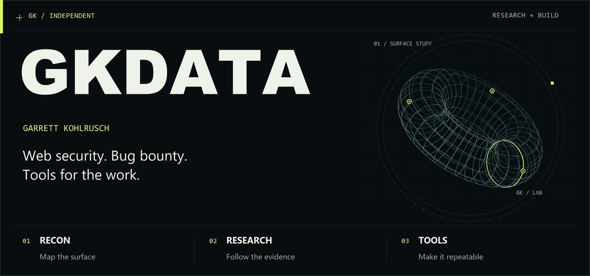
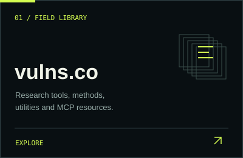
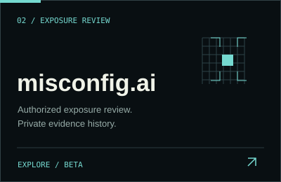
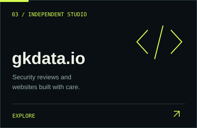

<picture>
  <source media="(prefers-reduced-motion: reduce) and (max-width: 600px)" srcset="assets/profile-hero-mobile-static.png">
  <source media="(prefers-reduced-motion: reduce)" srcset="assets/profile-hero-static.png">
  <source media="(max-width: 600px)" srcset="assets/profile-hero-mobile.gif">
  
</picture>

# Garrett Kohlrusch · GKData

Independent security researcher and founder of **GK Data LLC**. I build tools and reference material for web security research, and run independent web services.

## In the field

  
  
  

### [vulns.co](https://vulns.co/)

A field library for authorized security research: useful tools, methods, checklists, utilities, and MCP resources.

### [misconfig.ai](https://misconfig.ai/) · beta

An evolving project for authorized exposure review and private evidence history.

### [gkdata.io](https://gkdata.io/)

Independent security and web services from GK Data LLC: reviews, builds, redesigns, migrations, and WordPress care.

## Public research

The [**Security Research Library →**](https://github.com/gkdataio/security-research-library) brings together source-backed disclosures, program references, original diagrams, and structured JSON for researchers and builders.

## Small tools, built for the work

- [BB-Header-Manager](https://github.com/gkdataio/BB-Header-Manager) — a lightweight way to identify authorized research traffic.
- [applyzer](https://github.com/gkdataio/applyzer) — a small web-technology detection utility.
- [GatePeek](https://github.com/gkdataio/GatePeek) — a compact public utility for reconnaissance workflows.

<a href="https://www.linkedin.com/in/kohlrusch/">LinkedIn</a> · <a href="https://gkdata.io/">gkdata.io</a> · <a href="https://github.com/gkdataio/security-research-library">research library</a> · <a href="assets/profile-hero-static.png">static artwork</a>
