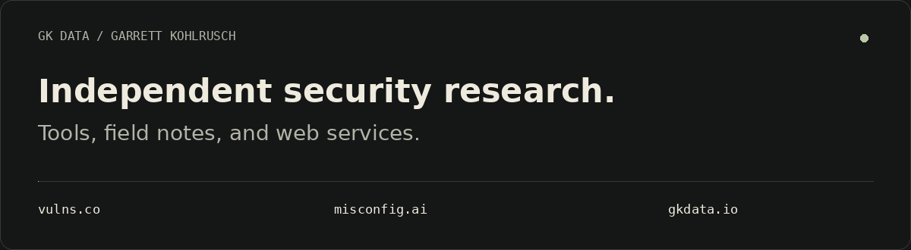

<picture>
  <source media="(prefers-reduced-motion: reduce)" srcset="assets/banner-static.png">
  
</picture>

# Garrett Kohlrusch

Founder of **GK Data LLC**. Independent security researcher.

Building practical resources for authorized security research and independent web services.

## Projects

### [vulns.co](https://vulns.co/)

A field library for authorized security research: tools, methods, checklists, utilities, and MCP resources.

### [misconfig.ai](https://misconfig.ai/)

A beta project focused on authorized exposure review and private evidence history. Capabilities and availability are evolving.

### [gkdata.io](https://gkdata.io/)

Independent security and website services from GK Data LLC, including application reviews, new builds, redesigns, migrations, and WordPress care.

## Research approach

Written authorization, clear scope, evidence-backed findings, practical remediation, and explicit limitations.

## Public research

The [Security Research Library](https://github.com/gkdataio/security-research-library) brings together source-backed disclosures, learning resources, original diagrams, and structured JSON.

## Elsewhere

